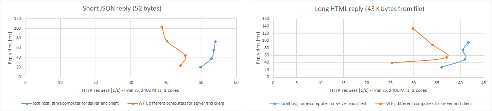

# vb6WebServer

**A simple programmable web server implemented in VisualBasic 6**

## Supports:
- HTTP protocol
- HTML and other files
- programmable HTTP replies 
- cookies

## Does not support:
- SSL/TLS protocol
- Websockets
- simultaneous handling of many HTTP requests (multithreading)

**vb6WebServer performance** 

